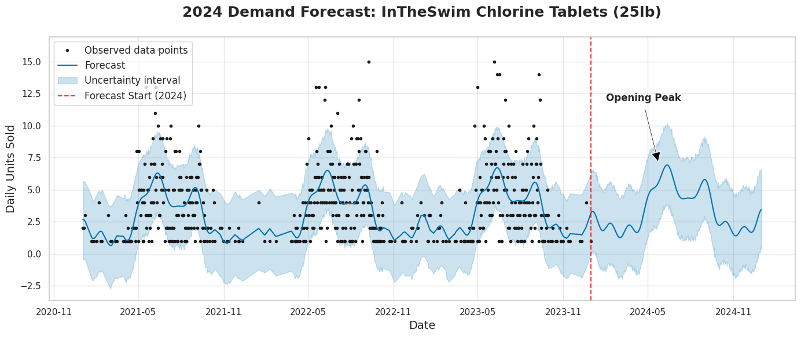

# 🏊‍♂️ Pool Supply Inventory Forecasting & Optimization

## 📌 Executive Summary
In retail and distribution, relying on "last year's numbers plus 10%" for procurement often leads to capital tied up in dead stock or lost revenue due to stockouts. This project replaces gut-feeling procurement with a **data-driven machine learning pipeline** to forecast seasonal inventory needs. 

Using **Facebook Prophet** for time-series forecasting, this model analyzes three years of historical transactional data to predict 2024 unit demand. Crucially, it translates those raw unit predictions into a **Financial Bulk Order Recommendation**, applying real-world supply chain constraints (distributor case sizes and pack quantities) to output exact purchasing requirements.

## 📊 The Business Problem & Domain Logic
The pool supply industry features extreme seasonality and varying product velocities that standard moving-average models fail to capture:
* **Bimodal Seasonality:** Demand does not follow a standard bell curve. There is a massive spike in late May (Pool Openings / School Ending), a maintenance plateau through July, and a secondary, sharp spike in early September (Labor Day Closings).
* **ABC Inventory Classification:** Products consume capital differently. "Class A" maintenance items (Shock, Chlorine Tablets) have high sales velocity and require weekly replenishment. "Class C" balancers (Alkalinity Increasers) are sold almost exclusively during the opening/closing spikes.

*Note: Due to privacy constraints, the dataset powering this repository is synthetically generated using a custom Python script (`01_generate_synthetic_data.ipynb`) specifically engineered to replicate these exact bimodal business cycles and velocity weights.*

## 🛠️ Methodology
### 1. Data Architecture
The data is structured relationally to separate master inventory constraints from transactional logs:
* `pool_products_master.csv`: Contains SKUs, Base Costs, Retail Prices, and strict `Case_Qty` pack sizes dictated by distributors.
* `pool_sales_history.csv`: Contains 3 years of daily transactional data (individual units sold).

### 2. Predictive Modeling (Facebook Prophet)
Facebook Prophet was chosen over standard ARIMA models because of its robust handling of multi-seasonality and daily data. 
* The model was trained individually on each SKU to isolate unique demand curves.
* It successfully identified the historical May/September spikes and projected them accurately across the 366 days of 2024.

### 3. Supply Chain Math
Predicting that a business will sell 412 units of "1lb Pool Shock" is only half the battle. The final step bridges the gap between Data Science and Procurement. The script divides the predicted unit demand by the master `Case_Qty` and applies a mathematical ceiling function (`math.ceil`) to guarantee the recommended bulk order covers demand without stockouts.

## 📂 Repository Structure
* `01_generate_synthetic_data.ipynb` - The ETL pipeline and data engineering script that generates the bimodal, domain-specific datasets.
* `02_predictive_inventory_model.ipynb` - The core analytics engine. Pulls the CSVs from the cloud, visualizes historical trends, runs the Prophet ML models, and outputs the final procurement dataframe.
* `/pool_products_master.csv` - Synthesized Master Inventory constraints.
* `/pool_sales_history.csv` - Synthesized 3-year daily transaction log.
* `forecast_chart.png` - Visual output of the Prophet model.

## 📈 Visualizing the Forecast
*(Below is the Prophet forecast for the top-selling SKU, clearly demonstrating the model's ability to predict the May Opening and September Closing spikes for the upcoming year).*

## 💻 Tech Stack
* **Language:** Python
* **Data Manipulation:** `pandas`, `numpy`
* **Machine Learning:** `prophet` (Time-Series Forecasting)
* **Data Visualization:** `matplotlib`, `seaborn`
